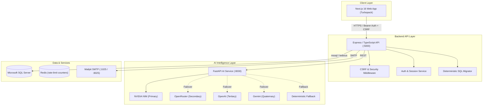

# CodeGuard AI

CodeGuard AI is an enterprise-grade AI-powered code analysis, security auditing, and developer intelligence platform. It provides automated security vulnerability detection, code quality reviews, architecture analysis, and multi-provider AI resilience.

---

## 1. Project Overview

CodeGuard AI is architected as a modular TypeScript and Python monorepo designed for high reliability, strict security, and deterministic AI execution.

* **Primary Capabilities**: Automated static and AI-assisted security scanning, code quality reviews, documentation generation, and interview evaluation.
* **Resilience**: Multi-tiered AI provider fallback system ensuring uninterrupted analysis availability.
* **Security-First Design**: HttpOnly cookie-based session management, double-submit CSRF protection, constant-time cryptographic operations, sanitized error handling, and transactional database migrations.

---

## 2. Architecture



---

## 3. Technology Stack

| Layer | Technologies |
| :--- | :--- |
| **Frontend** | Next.js 16.3.2, React 19, Tailwind CSS, Turbopack, TypeScript |
| **Backend API** | Node.js 20, Express 4, TypeScript, Zod, Pino, Supertest, Vitest |
| **AI Service** | Python 3.11, FastAPI, Uvicorn, Pydantic, HTTPX, Pytest |
| **Database** | Microsoft SQL Server (Transact-SQL), `mssql` / `tedious` driver |
| **Local Services** | Mailpit (SMTP development testing server), Docker & Docker Compose |
| **Tooling & Build** | npm workspaces, dumb-init containerization, Vitest, Pytest |

---

## 4. AI Provider Architecture

The AI service implements a prioritized, multi-tier provider chain with circuit-breaker protection and automatic failover:

```
1. NVIDIA NIM (Primary: meta/llama-3.2-11b-vision-instruct, meta/llama-3.2-90b-vision-instruct)
   ↓ (on timeout / failure)
2. OpenRouter (Secondary: meta-llama/llama-3.2-3b-instruct)
   ↓ (on failure)
3. OpenAI (Tertiary: gpt-4o-mini)
   ↓ (on failure)
4. Gemini (Quaternary: gemini-2.5-flash)
   ↓ (on failure)
5. Deterministic Rule-Based Fallback (Local static analysis parser)
```

* **Failover Behavior**: Providers are invoked in sequence. If a provider fails or exceeds timeout thresholds, the manager automatically rolls over to the next configured provider.
* **Deterministic Fallback**: If all external LLM APIs are unreachable, the system executes local AST and rule-based heuristic checks to guarantee an analysis response.

---

## 5. Authentication Architecture

CodeGuard AI implements a hardened hybrid authentication pattern separating short-lived bearer access from long-lived cookie refresh state:

* **Access Token**:
  * Format: Short-lived JSON Web Token (JWT), 15-minute expiration.
  * Transmission: HTTP `Authorization: Bearer <token>` header.
  * Browser Storage: Memory / client-side storage for active API calls.
* **Refresh Token**:
  * Format: Cryptographically signed JWT with unique UUID `jti`.
  * Transmission: `HttpOnly` cookie (`codeguard_refresh_token`).
  * Scoping: `Path=/api/auth`, `SameSite=Lax`, `Secure=true` in production, `Max-Age=7 days`.
  * Server-Side Persistence: Stored in `dbo.RefreshTokens` and `dbo.Sessions` tables.
  * Rotation & Revocation: Rotated upon every refresh operation; revoked immediately upon logout.
  * JSON Response Isolation: Refresh tokens are **never** returned in JSON response bodies.

---

## 6. CSRF Protection (Phase 3B)

To protect browser clients against Cross-Site Request Forgery on cookie-dependent endpoints, CodeGuard AI enforces a **Double-Submit Cookie + Origin Validation** defense:

* **CSRF Token Cookie**:
  * Name: `codeguard_csrf_token`
  * Attributes: `HttpOnly=false` (accessible to client JavaScript), `Path=/`, `SameSite=Lax`, `Secure=true` in production.
  * Entropy: 32 cryptographically random bytes (64-character hex string via `crypto.randomBytes`).
* **Header Contract**:
  * Transmitted by client JavaScript in the `X-CSRF-Token` HTTP header on mutating requests (`POST`, `PUT`, `PATCH`, `DELETE`).
* **Validation Middleware (`csrfProtection`)**:
  * **Safe Methods**: `GET`, `HEAD`, `OPTIONS` are exempt.
  * **Origin / Referer Enforcement**: Strictly validates `Origin` against allowed origins. Arbitrary `*.vercel.app` domains and production localhost are rejected.
  * **Constant-Time Comparison**: Compares cookie token against header token using `crypto.timingSafeEqual`.
  * **Bearer Client Compatibility**: Non-browser clients authenticating strictly via `Authorization: Bearer` without ambient auth cookies are not blocked.
* **Protected Routes**:
  * `POST /api/auth/refresh`
  * `POST /api/auth/logout`
  * `POST /api/auth/logout-all`
  * `POST /api/auth/reset-password/request` & `POST /api/auth/request-password-reset`
  * `POST /api/auth/reset-password/confirm` & `POST /api/auth/reset-password`
  * `POST /api/auth/resend-verification`
  * `GET /api/auth/csrf` (Dedicated token issuance endpoint)

---

## 7. Account Lockout & Brute-Force Defense

* **Persistent SQL-Backed State**: Login failure counters and lockout timestamps are persisted directly in `dbo.Users` via `FailedLoginCount INT` and `LockedUntil DATETIME2`.
* **Atomic T-SQL Increments**: Increments and threshold checks execute within a single atomic T-SQL `UPDATE ... OUTPUT` statement, preventing read-modify-write lost updates under concurrent attack bursts.
* **Configurable Lockout Policy**:
  * `MAX_FAILED_LOGIN_ATTEMPTS`: Maximum consecutive failed logins before lockout (default: `5`).
  * `ACCOUNT_LOCKOUT_DURATION`: Lockout duration string (e.g. `15m`, `1h`, `7d`, default: `15m`).
* **Threshold & Lockout Behavior**:
  * Once the threshold is reached, `LockedUntil` is set to database UTC time (`SYSUTCDATETIME()`) + configured duration.
  * While an account is locked (`LockedUntil > SYSUTCDATETIME()`), all authentication attempts immediately return `403 { error: "ACCOUNT_LOCKED" }` without executing expensive bcrypt password hashing operations.
* **Automatic Reset on Successful Authentication**:
  * Providing the correct password for an unlocked account resets `FailedLoginCount` to `0` and clears `LockedUntil` to `NULL`.
  * If a lock has expired (`LockedUntil <= SYSUTCDATETIME()`), a subsequent successful login clears the expired lock and grants access.
* **Timing Attack Mitigation**:
  * When a login is attempted for a non-existent email address, the API performs a dummy bcrypt verification against a valid precomputed work-factor-12 hash (`DUMMY_BCRYPT_HASH`). This ensures uniform processing time while creating zero database records.
* **Defense-in-Depth Layering**:
  * **Redis Rate Limiting (Phase 4A)**: Throttles high-frequency IP-based request bursts across distributed API replicas.
  * **SQL Account Lockout (Phase 4B)**: Enforces persistent, per-account brute-force protections across credential stuffing attempts targeting specific user identities.

---

## 8. Distributed Rate Limiting & Redis

* **Distributed Rate Limiting Engine**: Backed by Redis via `rate-limit-redis` and `express-rate-limit`.
* **Shared Cluster Counters**: Synchronizes request counters across multiple API replicas using namespace `codeguard:ratelimit:`.
* **Standard Headers**: Emits `RateLimit-Policy`, `RateLimit-Limit`, `RateLimit-Remaining`, and `RateLimit-Reset` headers.
* **Client Identification & Ingress Trust**:
  * Identity is derived from Express `req.ip` configured for exactly one trusted reverse-proxy/ingress hop (`app.set("trust proxy", 1)`).
  * The application does **not** parse `X-Forwarded-For` headers directly.
  * In production, the upstream ingress/load balancer must sanitize client-supplied forwarding headers to prevent IP spoofing.
* **Credential Isolation**: Redis keys and log traces strictly exclude JWT tokens, session identifiers, passwords, and cookies.
* **Failure Semantics & Safe Degradation**:
  * **Redis connected**: Distributed rate limiting across all API replicas.
  * **Redis unavailable**: Bounded per-process `MemoryStore` fallback.
  * Fallback is **not** distributed across replicas (each replica enforces the configured limit locally).
  * The system does **not** fail open to unlimited requests; limits remain enforced per process with throttled warning logs.

---

## 9. Database Architecture & Managed Cloud Database (Azure SQL)

* **Database Engine**: Microsoft SQL Server (T-SQL).
* **Managed Cloud Database Target**: [Azure SQL Database](https://azure.microsoft.com/en-us/products/azure-sql/database) is the recommended managed production database platform, providing managed high availability, automated backups, and compliant TLS encryption.
* **Deterministic Migration Engine** (`apps/api/src/migration-runner.ts`):
  * Tracking Table: `dbo._migrations` (automatically created on clean managed databases).
  * Integrity: SHA-256 checksums stored per migration. Modifying an applied migration causes startup to abort with a fatal error.
  * Order: Strictly sequential execution based on filename prefix (e.g., `001_initial.sql`).
  * Transactions: Each migration batch runs inside a dedicated database transaction.
* **Connection & TLS Hardening**:
  * Production TLS Policy: In `NODE_ENV=production`, `SQLSERVER_ENCRYPT=true` is enforced and `SQLSERVER_TRUST_SERVER_CERTIFICATE` **must** be `false`. Setting it to `true` in production causes startup configuration validation to fail immediately.
  * Certificate Subject Name / Logical Server FQDN: For Azure SQL Database, the application connects to the logical server FQDN (`<server>.database.windows.net`), which is validated against public Certificate Authorities even when traffic routes via Private Endpoints. The optional `SQLSERVER_SERVER_NAME` configuration is only needed when connecting through an intermediate proxy where the network connection hostname differs from the certificate DNS name.
* **Secret & Network Security**:
  * Database credentials (`SQLSERVER_USER`, `SQLSERVER_PASSWORD`) are injected via Railway Service/Sealed Variables and never committed.
  * Network access should be restricted to authorized Railway API egress IPs or Azure Private Link / Private Endpoints.
* **Scope Note**: Phase 6A establishes application code and driver compatibility for Azure SQL Database. Cloud database provisioning itself is executed during infrastructure setup.

---

## 10. Docker Architecture

### Local Development (`docker-compose.yml`)
* `codeguard-web`: Next.js frontend on port `3000`.
* `codeguard-api`: Express API on port `5000`, connects to SQL Server Express on the host machine via `host.docker.internal:54833`.
* `codeguard-redis`: Redis 7 on port `6379` for distributed rate limiting.
* `codeguard-ai-service`: FastAPI service on port `8000`.
* `codeguard-mailpit`: SMTP development server on port `1025` (SMTP) and `8025` (Web UI).

### Production Topology (`docker-compose.prod.yml`)
* Managed Redis or internal Redis cluster via `REDIS_URL` (no public port published).
* AI Service internal-only network isolation (not exposed on host ports).
* Mandatory TLS certificate validation for remote managed SQL Server.
* Cloud SMTP provider configuration.
* Production Node.js non-root execution with `dumb-init` signal handling.

---

## 11. Production Secret Management & Deployment

* **Deployment Platform Targets**:
  * **Backend API (`apps/api`)**: Deployed to [Railway](https://railway.app) (Node.js runtime container).
  * **AI Service (`apps/ai-service`)**: Deployed to [Railway](https://railway.app) (Python FastAPI container).
  * **Frontend Web App (`apps/web`)**: Deployed to [Vercel](https://vercel.com) (Next.js serverless / edge runtime).
* **Secret Isolation Boundaries**:
  * **GitHub Actions**: Stores deployment triggers only (`RAILWAY_TOKEN`, `VERCEL_TOKEN`, `VERCEL_ORG_ID`, `VERCEL_PROJECT_ID`). GitHub Actions does **not** store or manage application runtime secrets.
  * **Railway Runtime Secrets**: Production API and AI Service secrets (`JWT_ACCESS_SECRET`, `JWT_REFRESH_SECRET`, `SQLSERVER_PASSWORD`, `REDIS_URL`, `NVIDIA_API_KEY`, `OPENROUTER_API_KEY`, `OPENAI_API_KEY`, `GEMINI_API_KEY`, `SMTP_*`) are configured as **Railway Service Variables**.
  * **Railway Sealed Variables**: High-sensitivity credentials (database passwords, JWT secrets, AI API keys) should be stored as Sealed Variables in Railway. Sealed variables are write-only and cannot be viewed in the UI or retrieved via API.
  * *Important Railway Caveat*: Sealed variables are not copied automatically into PR/preview environments or duplicated branches. Dedicated staging/preview credentials must be explicitly configured per environment.
  * **Vercel Frontend Environment Variables**: Only non-secret, browser-visible configuration (e.g. `NEXT_PUBLIC_BACKEND_API_URL`) is exposed via `NEXT_PUBLIC_*`. Backend credentials, API keys, database connection strings, and JWT secrets must **never** be prefixed with `NEXT_PUBLIC_*`.
* **Zero-Secret Repository Policy**:
  * Production `.env` and `.env.*` files are excluded in `.gitignore` and never committed.
  * `.env.example` files are strictly non-sensitive templates.
  * `docker-compose.prod.yml` consumes environment variables at runtime via `${VARIABLE}` substitution rather than hardcoded literals.
* **Deterministic Deployment Pipeline Order**:
  ```
  GitHub push to main -> Deploy AI Service -> Deploy Backend API -> Deploy Frontend Web
  ```
* **Supply-Chain Hardened GitHub Actions**:
  * Deployment workflow uses least-privilege `permissions: contents: read`.
  * Third-party GitHub Actions are pinned to immutable commit SHAs (`actions/checkout@11bd719`, `bervProject/railway-deploy@8d82d4b`, `amondnet/vercel-action@de09aea`).

---

## 12. Environment Configuration

### Common / Local Development (`.env`)
```env
# General
NODE_ENV=development
PORT=5000
API_BASE_URL=http://localhost:5000
FRONTEND_URL=http://localhost:3000
CORS_ORIGIN=http://localhost:3000

# Authentication & JWT
JWT_ACCESS_SECRET=your-local-development-access-secret-32-chars
JWT_REFRESH_SECRET=your-local-development-refresh-secret-32-chars
AUTH_COOKIE_SECURE=false
AUTH_COOKIE_SAME_SITE=lax
AUTH_COOKIE_PATH=/api/auth
CSRF_COOKIE_NAME=codeguard_csrf_token
CSRF_COOKIE_PATH=/

# Account Lockout & Brute-Force Defense
MAX_FAILED_LOGIN_ATTEMPTS=5
ACCOUNT_LOCKOUT_DURATION=15m

# Rate Limiting & Redis
REDIS_URL=redis://localhost:6379
RATE_LIMIT_WINDOW_MS=60000
RATE_LIMIT_MAX_REQUESTS=120

# SQL Server (Host Express instance)
SQLSERVER_HOST=host.docker.internal
SQLSERVER_PORT=54833
SQLSERVER_USER=sa
SQLSERVER_PASSWORD=YourLocalDevPassword123!
SQLSERVER_DATABASE=CodeGuardAI
SQLSERVER_ENCRYPT=false
SQLSERVER_TRUST_SERVER_CERTIFICATE=true

# AI Service
AI_SERVICE_URL=http://ai-service:8000
NVIDIA_API_KEY=nvapi-your-nvidia-key
OPENROUTER_API_KEY=sk-or-your-openrouter-key
OPENAI_API_KEY=sk-your-openai-key
GEMINI_API_KEY=your-gemini-key

# SMTP (Mailpit)
SMTP_HOST=mailpit
SMTP_PORT=1025
SMTP_SECURE=false
EMAIL_FROM=noreply@codeguard.local
```

### Production Requirements (`.env.production` / Railway & Vercel Variables)
```env
NODE_ENV=production
JWT_ACCESS_SECRET=<high-entropy-64-char-random-secret>
JWT_REFRESH_SECRET=<high-entropy-64-char-random-secret>
AUTH_COOKIE_SECURE=true
SQLSERVER_ENCRYPT=true
SQLSERVER_TRUST_SERVER_CERTIFICATE=false
REDIS_URL=rediss://your-managed-redis-endpoint:6379
RATE_LIMIT_WINDOW_MS=60000
RATE_LIMIT_MAX_REQUESTS=120
MAX_FAILED_LOGIN_ATTEMPTS=5
ACCOUNT_LOCKOUT_DURATION=15m
FRONTEND_URL=https://app.yourdomain.com
CORS_ORIGIN=https://app.yourdomain.com
```

---

## 13. API Endpoints

### Health & Readiness
| Method | Path | Description |
| :--- | :--- | :--- |
| `GET` | `/health` | Liveness check reporting service status and uptime. |
| `GET` | `/ready` | Deep readiness check evaluating SQL Server, AI service, and Redis connectivity. |

### Authentication & CSRF
| Method | Path | Auth / Protection | Description |
| :--- | :--- | :--- | :--- |
| `GET` | `/api/auth/csrf` | Public | Vends a CSRF token and sets `codeguard_csrf_token` cookie. |
| `POST` | `/api/auth/register` | Public / Origin Check | Registers a user, sends verification email, sets CSRF cookie. |
| `GET` | `/api/auth/verify-email/:token` | Public | Verifies email address via verification token. |
| `POST` | `/api/auth/login` | Public / Origin Check | Authenticates credentials with account lockout, issues access token & HttpOnly refresh cookie. |
| `POST` | `/api/auth/refresh` | Cookie + CSRF Header | Rotates refresh token cookie and issues new access token. |
| `POST` | `/api/auth/logout` | Bearer + Cookie + CSRF | Revokes current session and clears refresh token cookie. |
| `POST` | `/api/auth/logout-all` | Bearer + Cookie + CSRF | Revokes all active sessions for the user. |
| `GET` | `/api/auth/me` | Bearer Token | Retrieves authenticated user profile. |
| `POST` | `/api/auth/resend-verification` | CSRF Protected | Resends email verification link. |
| `POST` | `/api/auth/reset-password/request` | CSRF Protected | Requests password reset email link. |
| `POST` | `/api/auth/reset-password/confirm` | CSRF Protected | Sets new password using reset token. |

### Analysis Endpoints
| Method | Path | Auth | Description |
| :--- | :--- | :--- | :--- |
| `POST` | `/api/analyses/code-review` | Bearer Token | Executes AI code review with findings, quality score, and suggestions. |
| `POST` | `/api/analyses/security-analysis` | Bearer Token | Executes security audit with vulnerability classifications and remediation. |
| `GET` | `/api/analyses` | Bearer Token | Returns historical code analyses for authenticated user. |

---

## 14. Security Hardening Matrix

* ✅ **Production JWT Secret Enforcement**: Startup rejects default or predictable secrets in production mode.
* ✅ **Strict CORS Policy**: Disallows wildcard/arbitrary origins; validates explicit origins.
* ✅ **Cryptographic JTI Generation**: Session and token identifiers use secure UUIDv4 and random entropy.
* ✅ **Sanitized Error Responses**: Production error handler hides internal traces, database details, and system paths.
* ✅ **AI API Key Redaction**: Diagnostic logs and trace outputs automatically sanitize and mask provider API keys.
* ✅ **Strict SQL Server TLS Validation**: Production requires encrypted channels and rejects untrusted server certificates.
* ✅ **Transactional Migration Engine**: Deterministic ordering with SHA-256 checksum integrity tracking.
* ✅ **HttpOnly Cookie Refresh Tokens**: Scoped to `/api/auth`, isolated from browser JavaScript.
* ✅ **Refresh Token Rotation & Revocation**: One-time use refresh tokens persisted and revocable server-side.
* ✅ **Double-Submit CSRF Protection**: Timing-safe token comparison and origin validation on state mutations.
* ✅ **Distributed Redis Rate Limiting**: Shared cluster counters with namespace prefixing, safe degraded failover, and sanitized logs.
* ✅ **SQL-Backed Account Lockout & Brute-Force Defense**: Atomic SQL-level failure tracking, threshold lockout, bcrypt bypass on locked accounts, and dummy hash timing attack protection.
* ✅ **Platform-Native Production Secret Management**: Zero runtime secrets in git/CI; Railway Sealed Variables & Vercel Sensitive Variables used for production secret injection.
* ✅ **Managed Cloud Database (Azure SQL) Readiness**: Strict TLS certificate validation, optional SAN matching with `SQLSERVER_SERVER_NAME`, sanitized error diagnostics, and idempotent transactional migrations.

---

## 15. Testing & Verification

### Test Suites & Status

```bash
# 1. Run all Backend API Vitest Suites (162 tests in 12 files)
npm run test:all -w apps/api

# 2. Run Database TLS & Managed Cloud Readiness Suite (15 tests)
npx vitest run tests/database.connection.test.ts -w apps/api

# 3. Run Production Secret Management & Deployment Hardening Suite (14 tests)
npx vitest run tests/deployment-secrets.test.ts -w apps/api

# 4. Run Account Lockout & Brute-Force Defense Suite (16 tests)
npx vitest run tests/account-lockout.test.ts -w apps/api

# 5. Run Distributed Redis Rate Limiter Suite (14 tests)
npx vitest run tests/rate-limit.test.ts -w apps/api

# 6. Run Dedicated CSRF Protection Suite (23 tests)
npx vitest run tests/csrf.test.ts -w apps/api

# 7. Run HttpOnly Cookie & Session Suite (9 tests)
npx vitest run tests/auth.cookies.test.ts -w apps/api

# 8. Run AI Service Pytest Suite (65 tests)
python -m pytest apps/ai-service/tests -q

# 9. Full Monorepo Build Check (TypeScript + Next.js Turbopack)
npm run build
```

**Verified Test Results**:
* **Backend API (`apps/api`)**: `162 passed`, `2 skipped` (164 total across 12 test files)
* **AI Service (`apps/ai-service`)**: `65 passed` (100%)
* **TypeScript & Web Build**: Clean compilation without errors or warnings.

---

## 16. Local Development Quick Start

### Prerequisites
* Node.js 20+ and npm 10+
* Python 3.11+
* Docker Desktop
* Microsoft SQL Server Express (running on host Windows machine or Docker)

### Step-by-Step Setup

1. **Clone and Install Dependencies**:
   ```bash
   git clone https://github.com/your-org/CodeGuard-AI.git
   cd CodeGuard-AI
   npm install
   ```

2. **Configure Environment Variables**:
   ```bash
   cp .env.example .env
   # Edit .env with your local SQL Server password, AI provider keys, and Redis URL
   ```

3. **Start Local Docker Services**:
   ```bash
   docker compose up -d
   ```

4. **Verify Container Health**:
   ```bash
   docker compose ps
   ```

5. **Access Local Services**:
   * **Web Application**: `http://localhost:3000`
   * **API Liveness**: `http://localhost:5000/health`
   * **API Readiness**: `http://localhost:5000/ready`
   * **AI Service Health**: `http://localhost:8000/health`
   * **Mailpit Web UI (Emails)**: `http://localhost:8025`
   * **Redis Server**: `localhost:6379`

---

## 17. Production Readiness Status

> [!WARNING]
> **Production Status: Hardened Staging / Pre-Production Baseline**
>
> While CodeGuard AI has undergone substantial security hardening across authentication, migrations, SQL TLS, CSRF protection, distributed rate limiting, account lockout, deployment secret isolation, and database cloud readiness, the application requires the following cloud infrastructure provisioning before general production traffic:

### Remaining Pre-Production Blockers:
1. **Managed Cloud Database Provisioning**: Provisioning the production Azure SQL Database resource, configuring firewall rules/Private Link, and executing initial migrations.
2. **Ingress / Reverse Proxy**: Edge TLS termination with Web Application Firewall (WAF) rules.

---

## 18. Recent Security Hardening Changelog

* **Commit `954e830`** (Phase 1): Production security hardening — enforced strong JWT secrets, strict CORS policy, cryptographic JTI tokens, sanitized production error responses, and AI API key log redaction.
* **Commit `5fe2a94`** (Phase 2A): Deterministic database migrations — introduced `dbo._migrations` history table, SHA-256 checksum verification, and transactional execution.
* **Commit `7ec4ae6`** (Phase 2B): SQL Server TLS hardening — enforced `SQLSERVER_ENCRYPT=true` and `SQLSERVER_TRUST_SERVER_CERTIFICATE=false` validation in production.
* **Commit `9373503`**: SQL Server schema alignment and repository query compatibility fixes.
* **Commit `402959b`** (Phase 3): HttpOnly refresh-token cookies — removed refresh tokens from browser `localStorage` and JSON responses, enforced `/api/auth` path scoping.
* **Commit `7c3b338` / Phase 3B**: Robust Double-Submit CSRF protection — implemented non-HttpOnly `codeguard_csrf_token`, `X-CSRF-Token` header verification, constant-time token comparison, neutral cookie utility architecture, and strict Origin/Referer enforcement.
* **Phase 4A**: Distributed Redis-backed Rate Limiting — implemented cluster-synchronized counters with namespace `codeguard:ratelimit:`, configurable window/limits, degraded in-memory failover, and credential masking.
* **Phase 4B**: SQL-Backed Account Lockout & Brute-Force Defense — implemented atomic SQL failure tracking (`FailedLoginCount`, `LockedUntil`), threshold lockout enforcement, bcrypt bypass for locked accounts, and dummy hash timing attack protection.
* **Phase 5**: Production Secret Management & Deployment Hardening — hardened GitHub Actions deployment workflows (least-privilege permissions, job-level env secret scoping, pinned action commit SHAs), established zero-secret repository boundaries, and documented platform-native secret management (Railway Sealed Variables & Vercel Sensitive Variables).
* **Phase 6A (Current)**: Managed Cloud Database Readiness — hardened SQL driver configuration for Azure SQL Database compatibility, added configurable certificate SAN matching (`SQLSERVER_SERVER_NAME`), implemented credential-safe SQL error classification & diagnostics, and validated migration determinism.
