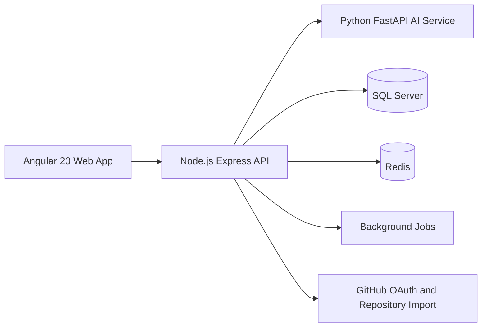

# CodeGuard AI

CodeGuard AI is an enterprise SaaS platform for AI code review, security analysis, repository intelligence, documentation generation, interview simulation, and candidate evaluation.

## Architecture

The repository is organized as a production-oriented monorepo:

- `apps/web`: Angular 20 frontend with modular feature areas.
- `apps/api`: Node.js, Express, TypeScript backend using clean architecture boundaries.
- `apps/ai-service`: FastAPI service that returns structured analysis JSON.
- `database`: SQL Server schema and ERD.
- `infra`: Docker and deployment scaffolding.
- `docs`: product, architecture, security, and delivery phase documentation.

## Local Development

1. Copy `.env.example` to `.env` and fill in secrets.
2. Start infrastructure with `docker compose -f infra/docker/docker-compose.yml up --build`.
3. Run backend with `npm run dev:api`.
4. Run frontend with `npm run dev:web`.
5. Run AI service with `uvicorn app.main:app --reload --app-dir apps/ai-service`.

## Delivery Phases

The full phased plan lives in [docs/phases.md](docs/phases.md).
