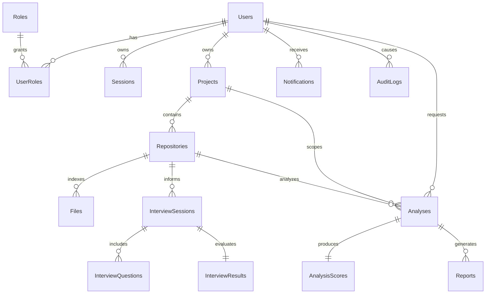

# CodeGuard AI ERD

```mermaid
erDiagram
  Users ||--o{ UserRoles : has
  Roles ||--o{ UserRoles : grants
  Users ||--o{ Sessions : owns
  Users ||--o{ Projects : owns
  Projects ||--o{ Repositories : contains
  Repositories ||--o{ Files : indexes
  Users ||--o{ Analyses : requests
  Projects ||--o{ Analyses : scopes
  Repositories ||--o{ Analyses : analyzes
  Analyses ||--|| AnalysisScores : produces
  Analyses ||--o{ Reports : generates
  Users ||--o{ Notifications : receives
  Users ||--o{ AuditLogs : causes
  Repositories ||--o{ InterviewSessions : informs
  InterviewSessions ||--o{ InterviewQuestions : includes
  InterviewSessions ||--|| InterviewResults : evaluates
```
