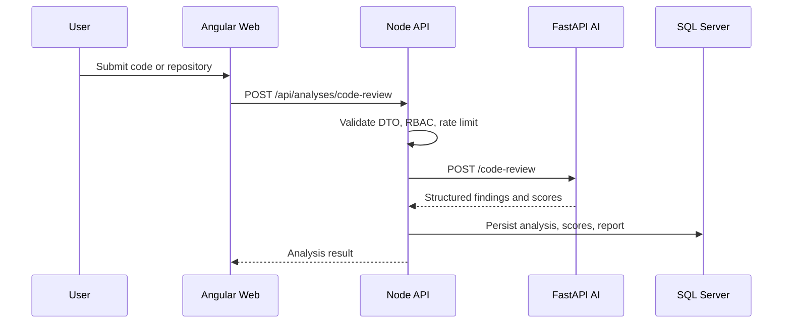

# System Architecture

CodeGuard AI follows a modular, microservice-ready architecture.

## Backend Layers

- `domain`: Entities and repository contracts with no framework dependencies.
- `application`: Use cases, DTOs, and service orchestration.
- `infrastructure`: SQL Server, Redis, queues, external clients, logging, and secrets.
- `interfaces`: HTTP controllers, middleware, OpenAPI, auth adapters, and request validation.

## Core Workflows

## Production Concerns

- Use managed SQL Server with transparent data encryption.
- Use Azure Key Vault for secrets and key rotation.
- Use private networking between API, AI service, database, and Redis.
- Emit audit events for authentication, authorization, imports, reports, and administrative changes.
- Queue repository cloning and large ZIP analysis jobs to avoid request timeouts.
